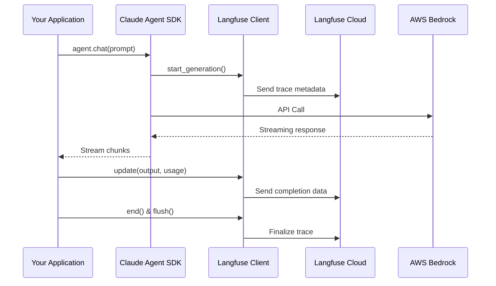

# Langfuse トレーシング概要

このドキュメントでは、Langfuse トレーシングの基本概念、アーキテクチャ、および本プロジェクトでの実装について説明します。

## 📖 目次

- [Langfuse とは](#langfuse-とは)
- [トレーシングの仕組み](#トレーシングの仕組み)
- [主要な概念](#主要な概念)
- [アーキテクチャ](#アーキテクチャ)
- [送信される情報](#送信される情報)
- [データフロー](#データフロー)

## Langfuse とは

Langfuse は、LLM アプリケーションの監視、評価、デバッグを行うための可観測性プラットフォームです。

### 主な機能

- **トレーシング** - すべての LLM 呼び出しを自動記録
- **コスト追跡** - トークン使用量からコストを自動計算
- **パフォーマンス分析** - レスポンス時間、トークン効率の測定
- **評価システム** - データセットベースの品質評価
- **ユーザー分析** - ユーザー別、セッション別のメトリクス

### なぜ Langfuse を使うのか

1. **可視化** - すべての LLM インタラクションを一元的に可視化
2. **デバッグ** - 問題のあるリクエストを素早く特定
3. **コスト管理** - トークン使用量とコストをリアルタイム追跡
4. **品質向上** - 評価データセットで継続的な品質改善
5. **ユーザー理解** - ユーザー行動の分析とインサイト獲得

## トレーシングの仕組み

### トレーシングフロー



### 自動トレーシング vs 手動トレーシング

#### 自動トレーシング（デコレータ）
```python
from langfuse import observe

@observe(as_type="generation")
async def chat(prompt: str) -> str:
    # Langfuse が自動的にトレース
    response = await query(prompt)
    return response
```

**メリット:**
- コードがシンプル
- 自動的にトレース開始・終了

**デメリット:**
- カスタマイズが限定的
- ストリーミングの細かい制御が難しい

#### 手動トレーシング
```python
generation = langfuse.start_generation(
    name="chat",
    model="claude-3-5-sonnet",
    input=prompt,
)

try:
    response = await query(prompt)
    generation.update(output=response)
except Exception as e:
    generation.update(level="ERROR", status_message=str(e))
    raise
finally:
    generation.end()
    langfuse.flush()
```

**メリット:**
- 完全な制御
- カスタムメタデータの追加
- エラーハンドリングの柔軟性

**デメリット:**
- コードが冗長
- 手動で end() と flush() を呼ぶ必要がある

**本プロジェクトの選択: 手動トレーシング**

ストリーミング対応と詳細なメタデータ記録のため、手動トレーシングを採用しています。

## 主要な概念

### Trace（トレース）
ユーザーリクエストから最終レスポンスまでの完全な実行フロー。

```
Trace: ユーザーの質問応答
├── Generation: LLM 呼び出し 1
├── Span: ツール実行
└── Generation: LLM 呼び出し 2
```

### Generation（生成）
LLM への単一の呼び出し。最も重要なトレース単位。

**含まれる情報:**
- 入力プロンプト
- 出力テキスト
- モデル名
- モデルパラメータ（temperature, max_tokens など）
- トークン使用量
- レスポンス時間

### Span（スパン）
LLM 以外の処理（ツール実行、データベースクエリなど）。

### Metadata（メタデータ）
カスタム情報を記録するための key-value ストア。

**制約:**
- キー: 英数字とアンダースコアのみ
- 値: 文字列（200文字以下）

## アーキテクチャ

### システム構成

```
┌─────────────────────────────────────────┐
│  Your Application (src/agent.py)        │
│  ┌───────────────────────────────────┐  │
│  │ BedrockAgentSDK                   │  │
│  │ ├── chat_streaming()              │  │
│  │ ├── chat()                        │  │
│  │ └── Langfuse Integration          │  │
│  └───────────────────────────────────┘  │
└────────────┬────────────────────────────┘
             │
    ┌────────┴─────────┐
    ▼                  ▼
┌─────────────┐  ┌──────────────────┐
│ AWS Bedrock │  │ Langfuse Cloud   │
│ (Claude 3+) │  │ (Tracing Server) │
└─────────────┘  └──────────────────┘
```

### データフロー

1. **リクエスト開始**
   - `start_generation()` でトレース開始
   - 入力プロンプト、モデル情報を送信

2. **LLM 実行**
   - Bedrock に API コール
   - ストリーミングレスポンスを受信

3. **リアルタイム更新**
   - トークン使用量を推定
   - メタデータを更新

4. **完了**
   - `update()` で最終データを送信
   - `end()` でトレース終了
   - `flush()` でバッファをクリア

## 送信される情報

### 必須フィールド

| フィールド | 型 | 説明 | 例 |
|-----------|-----|------|-----|
| `name` | string | Generation の名前 | "chat_streaming" |
| `model` | string | モデル識別子 | "anthropic.claude-3-5-sonnet-20241022-v2:0" |
| `input` | any | 入力プロンプト | "こんにちは" |
| `output` | any | 生成されたレスポンス | "こんにちは！..." |

### 推奨フィールド

| フィールド | 型 | 説明 | 例 |
|-----------|-----|------|-----|
| `model_parameters` | dict | モデルパラメータ | `{"temperature": 0.7, "max_tokens": 4096}` |
| `usage_details` | dict | トークン使用量 | `{"input": 50, "output": 25, "total": 75}` |
| `metadata` | dict | カスタムメタデータ | `{"session_id": "session-123", ...}` |

### usage_details の構造

```python
{
    "input": 150,              # 入力トークン数
    "output": 75,              # 出力トークン数
    "total": 225,              # 合計トークン数
    # オプション（キャッシュ対応モデル）
    "cache_read_input_tokens": 50,
    "cache_creation_input_tokens": 100,
}
```

### metadata の構造（本プロジェクト）

```python
{
    # セッション・ユーザー追跡
    "session_id": "session-123",
    "user_id": "user-456",

    # 環境情報
    "aws_region": "us-east-1",
    "version": "1.0.0",

    # 実行情報
    "streaming": "true",
    "sdk": "claude-agent-sdk",
    "cwd": "/path/to/working/directory",

    # ツール情報（BedrockAgentSDKWithClient のみ）
    "tools": "['Write', 'Read']",
    "tools_count": "2",

    # パフォーマンス
    "message_count": "1",
    "response_length": "1250",
}
```

## データフロー

### 1. 初期化フェーズ

```python
from langfuse import get_client

langfuse = get_client()
# .env から LANGFUSE_SECRET_KEY, LANGFUSE_PUBLIC_KEY を読み込み
```

### 2. トレース開始

```python
generation = langfuse.start_generation(
    name="chat_streaming",
    model=self.model,
    input=prompt,
    model_parameters={...},
    metadata={...},
)
# → Langfuse Cloud に送信
```

### 3. LLM 実行

```python
async for message in query(prompt=prompt):
    # Bedrock からストリーミング
    full_response += message_text
    yield message_text
```

### 4. トークン推定

```python
input_tokens = estimate_tokens(prompt)
output_tokens = estimate_tokens(full_response)
```

**トークン推定の仕組み:**
- `tiktoken` ライブラリを使用（GPT-4 エンコーディング）
- Claude モデルとの互換性を考慮した推定
- フォールバック: 4文字 ≈ 1トークン

### 5. 完了処理

```python
generation.update(
    output=full_response,
    usage_details={
        "input": input_tokens,
        "output": output_tokens,
        "total": input_tokens + output_tokens,
    },
)
generation.end()
langfuse.flush()
# → Langfuse Cloud に最終データ送信
```

## パフォーマンスへの影響

### ネットワークオーバーヘッド

- **バッチング**: Langfuse SDK は自動的にリクエストをバッチ処理
- **非同期送信**: トレースデータは非同期で送信
- **バッファリング**: `flush()` までバッファに蓄積

### レイテンシ

- **トレース開始**: < 1ms（ローカルバッファに記録）
- **トレース終了**: < 5ms（バッファをフラッシュ）
- **ネットワーク送信**: 非同期（アプリケーションをブロックしない）

### メモリ使用量

- **1トレースあたり**: 約 1-5 KB
- **バッファサイズ**: デフォルト 100 トレース
- **自動フラッシュ**: バッファが満杯になると自動送信

## セキュリティとプライバシー

### 送信されるデータ

✅ **送信される:**
- プロンプトテキスト
- レスポンステキスト
- トークン使用量
- モデルパラメータ
- メタデータ

❌ **送信されない:**
- AWS 認証情報
- API キー（Langfuse 自体の認証を除く）
- システムパスワード

### データの保管

- **保管場所**: Langfuse Cloud（US/EU リージョン選択可能）
- **暗号化**: TLS 1.2+ で送信、保存時も暗号化
- **保持期間**: プランに応じて設定可能

### プライバシー考慮事項

⚠️ **注意**: Langfuse に送信されるプロンプトとレスポンスには、機密情報を含めないでください。

**推奨事項:**
- PII（個人識別情報）のマスキング
- session_id / user_id には匿名 ID を使用
- 機密データはメタデータに含めない

## 次のステップ

- [実装ガイド](./implementation-guide.md) - 実際の実装方法を学ぶ
- [ベストプラクティス](./best-practices.md) - 運用のベストプラクティスを確認

## 参考リソース

- [Langfuse 公式ドキュメント](https://langfuse.com/docs)
- [OpenTelemetry について](https://opentelemetry.io/)
- [Langfuse Python SDK](https://langfuse.com/docs/observability/sdk/python/overview)
