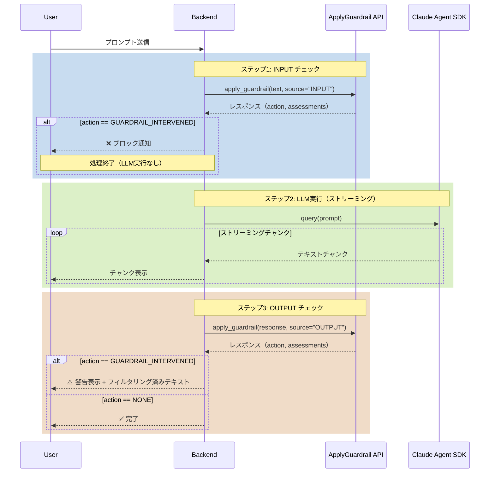
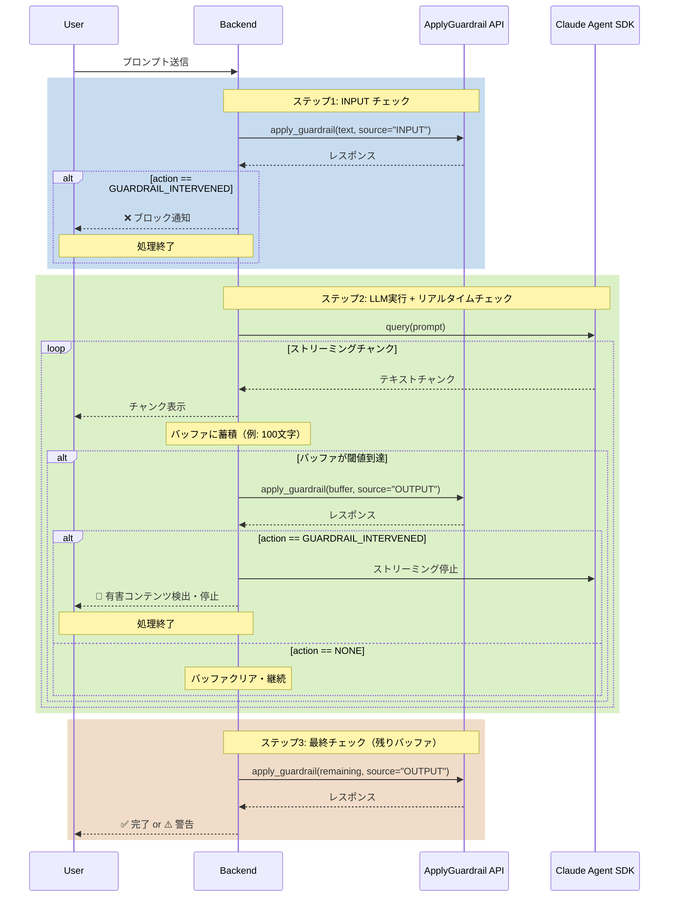
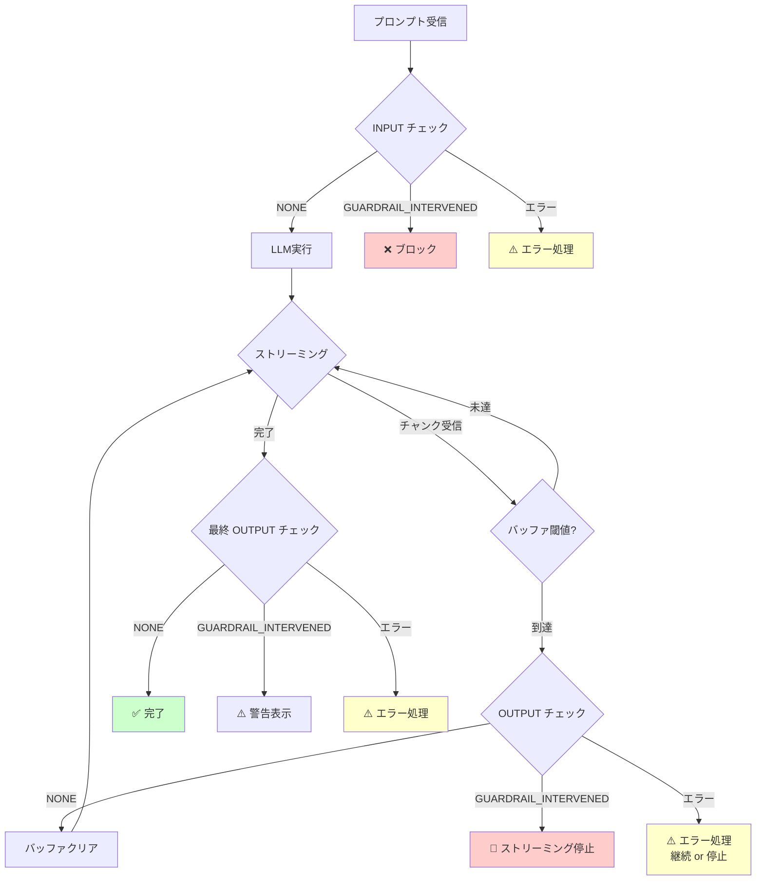

# Bedrock Guardrails ApplyGuardrail API - 実装ガイド

## 目次
1. [処理フロー図](#処理フロー図)
2. [APIレスポンスフォーマット](#apiレスポンスフォーマット)
3. [実装パターン](#実装パターン)
4. [エラーハンドリング](#エラーハンドリング)
5. [実装例](#実装例)

---

## 処理フロー図

### 1. 基本フロー：INPUT/OUTPUTチェック



### 2. リアルタイムチェックフロー（推奨）



### 3. エラーフロー



---

## APIレスポンスフォーマット

### ApplyGuardrail API レスポンス構造

詳細は公式ドキュメント参照：https://docs.aws.amazon.com/ja_jp/bedrock/latest/APIReference/API_runtime_ApplyGuardrail.html#API_runtime_ApplyGuardrail_ResponseSyntax

#### 1. 正常通過の場合（action: NONE）

```json
{
  "action": "NONE",
  "outputs": [
    {
      "text": "こんにちは。今日は良い天気ですね。"
    }
  ],
  "assessments": [
    {
      "contentPolicy": {
        "filters": [
          {
            "type": "SEXUAL",
            "confidence": "NONE",
            "filterStrength": "HIGH",
            "action": "NONE",
            "detected": false
          },
          {
            "type": "VIOLENCE",
            "confidence": "NONE",
            "filterStrength": "HIGH",
            "action": "NONE",
            "detected": false
          },
          {
            "type": "HATE",
            "confidence": "NONE",
            "filterStrength": "HIGH",
            "action": "NONE",
            "detected": false
          },
          {
            "type": "INSULTS",
            "confidence": "NONE",
            "filterStrength": "HIGH",
            "action": "NONE",
            "detected": false
          },
          {
            "type": "MISCONDUCT",
            "confidence": "NONE",
            "filterStrength": "HIGH",
            "action": "NONE",
            "detected": false
          },
          {
            "type": "PROMPT_ATTACK",
            "confidence": "NONE",
            "filterStrength": "HIGH",
            "action": "NONE",
            "detected": false
          }
        ]
      },
      "invocationMetrics": {
        "guardrailProcessingLatency": 385,
        "usage": {
          "topicPolicyUnits": 1,
          "contentPolicyUnits": 1,
          "wordPolicyUnits": 1,
          "sensitiveInformationPolicyUnits": 1,
          "sensitiveInformationPolicyFreeUnits": 1,
          "contextualGroundingPolicyUnits": 0,
          "contentPolicyImageUnits": 0,
          "automatedReasoningPolicyUnits": 0,
          "automatedReasoningPolicies": 0
        },
        "guardrailCoverage": {
          "textCharacters": {
            "guarded": 20,
            "total": 20
          }
        }
      },
      "appliedGuardrailDetails": {
        "guardrailId": "gifc1v7qwbdm",
        "guardrailVersion": "DRAFT",
        "guardrailArn": "arn:aws:bedrock:us-west-2:206863353204:guardrail/gifc1v7qwbdm",
        "guardrailOrigin": ["REQUEST"],
        "guardrailOwnership": "SELF"
      }
    }
  ]
}
```

#### 2. ブロックされた場合（action: GUARDRAIL_INTERVENED）

##### INPUT ブロック例

```json
{
  "action": "GUARDRAIL_INTERVENED",
  "outputs": [],
  "assessments": [
    {
      "contentPolicy": {
        "filters": [
          {
            "type": "VIOLENCE",
            "confidence": "HIGH",
            "filterStrength": "HIGH",
            "action": "BLOCKED",
            "detected": true
          },
          {
            "type": "MISCONDUCT",
            "confidence": "HIGH",
            "filterStrength": "HIGH",
            "action": "BLOCKED",
            "detected": true
          },
          {
            "type": "SEXUAL",
            "confidence": "NONE",
            "filterStrength": "HIGH",
            "action": "NONE",
            "detected": false
          },
          {
            "type": "HATE",
            "confidence": "NONE",
            "filterStrength": "HIGH",
            "action": "NONE",
            "detected": false
          },
          {
            "type": "INSULTS",
            "confidence": "NONE",
            "filterStrength": "HIGH",
            "action": "NONE",
            "detected": false
          },
          {
            "type": "PROMPT_ATTACK",
            "confidence": "NONE",
            "filterStrength": "HIGH",
            "action": "NONE",
            "detected": false
          }
        ]
      },
      "invocationMetrics": {
        "guardrailProcessingLatency": 399,
        "usage": {
          "topicPolicyUnits": 1,
          "contentPolicyUnits": 1,
          "wordPolicyUnits": 1,
          "sensitiveInformationPolicyUnits": 1,
          "sensitiveInformationPolicyFreeUnits": 1,
          "contextualGroundingPolicyUnits": 0,
          "contentPolicyImageUnits": 0,
          "automatedReasoningPolicyUnits": 0,
          "automatedReasoningPolicies": 0
        },
        "guardrailCoverage": {
          "textCharacters": {
            "guarded": 15,
            "total": 15
          }
        }
      },
      "appliedGuardrailDetails": {
        "guardrailId": "gifc1v7qwbdm",
        "guardrailVersion": "DRAFT",
        "guardrailArn": "arn:aws:bedrock:us-west-2:206863353204:guardrail/gifc1v7qwbdm",
        "guardrailOrigin": ["REQUEST"],
        "guardrailOwnership": "SELF"
      }
    }
  ]
}
```

##### OUTPUT ブロック例（フィルタリング後テキスト含む）

```json
{
  "action": "GUARDRAIL_INTERVENED",
  "outputs": [
    {
      "text": "申し訳ありません。生成されたコンテンツが当社のポリシーに違反しているため表示できません。"
    }
  ],
  "assessments": [
    {
      "contentPolicy": {
        "filters": [
          {
            "type": "INSULTS",
            "confidence": "HIGH",
            "filterStrength": "HIGH",
            "action": "BLOCKED",
            "detected": true
          },
          {
            "type": "SEXUAL",
            "confidence": "NONE",
            "filterStrength": "HIGH",
            "action": "NONE",
            "detected": false
          },
          {
            "type": "VIOLENCE",
            "confidence": "NONE",
            "filterStrength": "HIGH",
            "action": "NONE",
            "detected": false
          },
          {
            "type": "HATE",
            "confidence": "NONE",
            "filterStrength": "HIGH",
            "action": "NONE",
            "detected": false
          },
          {
            "type": "MISCONDUCT",
            "confidence": "NONE",
            "filterStrength": "HIGH",
            "action": "NONE",
            "detected": false
          },
          {
            "type": "PROMPT_ATTACK",
            "confidence": "NONE",
            "filterStrength": "HIGH",
            "action": "NONE",
            "detected": false
          }
        ]
      },
      "invocationMetrics": {
        "guardrailProcessingLatency": 422,
        "usage": {
          "topicPolicyUnits": 1,
          "contentPolicyUnits": 1,
          "wordPolicyUnits": 1,
          "sensitiveInformationPolicyUnits": 1,
          "sensitiveInformationPolicyFreeUnits": 1,
          "contextualGroundingPolicyUnits": 0,
          "contentPolicyImageUnits": 0,
          "automatedReasoningPolicyUnits": 0,
          "automatedReasoningPolicies": 0
        },
        "guardrailCoverage": {
          "textCharacters": {
            "guarded": 32,
            "total": 32
          }
        }
      },
      "appliedGuardrailDetails": {
        "guardrailId": "gifc1v7qwbdm",
        "guardrailVersion": "DRAFT",
        "guardrailArn": "arn:aws:bedrock:us-west-2:206863353204:guardrail/gifc1v7qwbdm",
        "guardrailOrigin": ["REQUEST"],
        "guardrailOwnership": "SELF"
      }
    }
  ]
}
```

### レスポンスフィールド解説

#### トップレベル

| フィールド | 型 | 説明 |
|-----------|-----|------|
| `action` | string | `NONE` = 通過, `GUARDRAIL_INTERVENED` = ブロック/フィルタリング |
| `outputs` | array | フィルタリング後のテキスト（OUTPUTチェック時のみ）|
| `assessments` | array | 評価結果の詳細 |

#### assessments[0].contentPolicy.filters[]

| フィールド | 型 | 説明 |
|-----------|-----|------|
| `type` | string | フィルタータイプ: `SEXUAL`, `VIOLENCE`, `HATE`, `INSULTS`, `MISCONDUCT`, `PROMPT_ATTACK` |
| `confidence` | string | 検出信頼度: `NONE`, `LOW`, `MEDIUM`, `HIGH` |
| `filterStrength` | string | フィルター強度設定: `NONE`, `LOW`, `MEDIUM`, `HIGH` |
| `action` | string | 実行されたアクション: `NONE`, `BLOCKED` |
| `detected` | boolean | このフィルターで検出されたか |

#### assessments[0].invocationMetrics

| フィールド | 型 | 説明 |
|-----------|-----|------|
| `guardrailProcessingLatency` | integer | 処理レイテンシ（ミリ秒） |
| `usage` | object | 使用したユニット数（コスト計算用） |
| `guardrailCoverage` | object | チェックした文字数 |

#### assessments[0].appliedGuardrailDetails

| フィールド | 型 | 説明 |
|-----------|-----|------|
| `guardrailId` | string | Guardrail ID |
| `guardrailVersion` | string | バージョン（例: `DRAFT`, `1`, `2`） |
| `guardrailArn` | string | AWS ARN |
| `guardrailOrigin` | array | 適用元（`REQUEST` = API呼び出し） |
| `guardrailOwnership` | string | 所有権（`SELF` = 自分のアカウント） |

---

## 実装パターン

### パターン1: INPUT/OUTPUTチェック（基本）

```python
import boto3
import json
from typing import Dict, Any

class GuardrailChecker:
    def __init__(self, guardrail_id: str, guardrail_version: str = "DRAFT", aws_region: str = "us-west-2"):
        self.guardrail_id = guardrail_id
        self.guardrail_version = guardrail_version
        self.bedrock_runtime = boto3.client("bedrock-runtime", region_name=aws_region)
    
    def check(self, text: str, source: str = "INPUT") -> Dict[str, Any]:
        """
        ApplyGuardrail API でテキストをチェック
        
        Args:
            text: チェックするテキスト
            source: "INPUT" または "OUTPUT"
        
        Returns:
            {
                "is_blocked": bool,
                "action": str,
                "filtered_text": str,
                "detected_policies": List[str],
                "raw_response": dict
            }
        """
        response = self.bedrock_runtime.apply_guardrail(
            guardrailIdentifier=self.guardrail_id,
            guardrailVersion=self.guardrail_version,
            source=source,
            content=[{"text": {"text": text}}]
        )
        
        action = response.get("action", "NONE")
        is_blocked = action == "GUARDRAIL_INTERVENED"
        
        # フィルタリング後のテキスト取得
        filtered_text = text
        if source == "OUTPUT" and response.get("outputs"):
            filtered_text = response["outputs"][0]["text"]
        
        # 検出されたポリシー
        detected_policies = []
        for assessment in response.get("assessments", []):
            if "contentPolicy" in assessment:
                for filter_item in assessment["contentPolicy"].get("filters", []):
                    if filter_item.get("detected"):
                        detected_policies.append({
                            "type": filter_item.get("type"),
                            "confidence": filter_item.get("confidence")
                        })
        
        return {
            "is_blocked": is_blocked,
            "action": action,
            "filtered_text": filtered_text,
            "detected_policies": detected_policies,
            "latency_ms": response.get("assessments", [{}])[0].get("invocationMetrics", {}).get("guardrailProcessingLatency"),
            "raw_response": response
        }

# 使用例
checker = GuardrailChecker(guardrail_id="gifc1v7qwbdm")

# INPUT チェック
input_result = checker.check("ユーザーのプロンプト", source="INPUT")
if input_result["is_blocked"]:
    print("❌ ブロックされました")
    print(f"検出: {input_result['detected_policies']}")
    # エラーレスポンスを返す
else:
    # LLMを実行
    llm_response = call_llm(input_result["filtered_text"])
    
    # OUTPUT チェック
    output_result = checker.check(llm_response, source="OUTPUT")
    if output_result["is_blocked"]:
        print("⚠️ 出力がフィルタリングされました")
        # フィルタリング後のテキストを返す
        return output_result["filtered_text"]
    else:
        return llm_response
```

### パターン2: リアルタイムチェック（推奨）

```python
import asyncio
from typing import AsyncGenerator

class RealtimeGuardrailChecker:
    def __init__(self, guardrail_id: str, check_interval: int = 100):
        self.guardrail_id = guardrail_id
        self.check_interval = check_interval
        self.checker = GuardrailChecker(guardrail_id)
    
    async def stream_with_check(
        self, 
        llm_stream: AsyncGenerator[str, None]
    ) -> AsyncGenerator[Dict[str, Any], None]:
        """
        LLMストリーミングをGuardrailsでチェックしながら返す
        
        Args:
            llm_stream: LLMからのストリーミングジェネレータ
        
        Yields:
            {
                "type": "chunk" | "blocked",
                "text": str,
                "detected_policies": List[str] | None
            }
        """
        buffer = ""
        full_response = ""
        
        async for chunk in llm_stream:
            full_response += chunk
            buffer += chunk
            
            # チャンクを返す
            yield {
                "type": "chunk",
                "text": chunk
            }
            
            # バッファが閾値到達
            if len(buffer) >= self.check_interval:
                result = self.checker.check(buffer, source="OUTPUT")
                
                if result["is_blocked"]:
                    # ブロック通知を返す
                    yield {
                        "type": "blocked",
                        "text": "",
                        "detected_policies": result["detected_policies"]
                    }
                    # ストリーミング停止
                    break
                
                buffer = ""  # バッファクリア
        
        # 最終チェック（残りのバッファ）
        if buffer and not result.get("is_blocked"):
            result = self.checker.check(full_response, source="OUTPUT")
            if result["is_blocked"]:
                yield {
                    "type": "blocked",
                    "text": result["filtered_text"],
                    "detected_policies": result["detected_policies"]
                }

# 使用例
async def handle_request(user_prompt: str):
    checker = RealtimeGuardrailChecker(guardrail_id="gifc1v7qwbdm", check_interval=100)
    
    # INPUT チェック
    input_result = checker.checker.check(user_prompt, source="INPUT")
    if input_result["is_blocked"]:
        return {
            "status": "blocked",
            "message": "プロンプトがポリシーに違反しています",
            "policies": input_result["detected_policies"]
        }
    
    # LLMストリーミング実行
    llm_stream = call_llm_streaming(user_prompt)
    
    # リアルタイムチェック付きでストリーミング
    async for event in checker.stream_with_check(llm_stream):
        if event["type"] == "chunk":
            # フロントエンドにチャンクを送信
            await send_to_frontend(event["text"])
        elif event["type"] == "blocked":
            # ブロック通知を送信
            await send_to_frontend({
                "type": "error",
                "message": "有害なコンテンツを検出しました",
                "policies": event["detected_policies"]
            })
            break
```

---

## エラーハンドリング

### 1. API呼び出しエラー

```python
from botocore.exceptions import ClientError

def safe_guardrail_check(text: str, source: str) -> Dict[str, Any]:
    """エラーハンドリング付きGuardrailsチェック"""
    try:
        result = checker.check(text, source)
        return result
    
    except ClientError as e:
        error_code = e.response['Error']['Code']
        
        if error_code == 'ValidationException':
            # Guardrailsによるブロック
            return {
                "is_blocked": True,
                "action": "GUARDRAIL_INTERVENED",
                "error": str(e)
            }
        
        elif error_code == 'ThrottlingException':
            # レート制限
            print("⚠️ レート制限に達しました。リトライします...")
            time.sleep(1)
            return safe_guardrail_check(text, source)
        
        elif error_code == 'ResourceNotFoundException':
            # Guardrailが見つからない
            print("❌ Guardrailが見つかりません")
            # フォールバック: チェックなしで続行
            return {
                "is_blocked": False,
                "action": "NONE",
                "filtered_text": text,
                "detected_policies": [],
                "error": "Guardrail not found"
            }
        
        else:
            # その他のエラー
            print(f"❌ 予期しないエラー: {e}")
            # フォールバック: チェックなしで続行（または中断）
            return {
                "is_blocked": False,
                "action": "NONE",
                "filtered_text": text,
                "detected_policies": [],
                "error": str(e)
            }
    
    except Exception as e:
        # その他の予期しないエラー
        print(f"❌ 予期しないエラー: {e}")
        return {
            "is_blocked": False,
            "action": "NONE",
            "filtered_text": text,
            "detected_policies": [],
            "error": str(e)
        }
```

### 2. タイムアウト処理

```python
import asyncio
from concurrent.futures import TimeoutError

async def check_with_timeout(text: str, source: str, timeout: float = 5.0) -> Dict[str, Any]:
    """タイムアウト付きGuardrailsチェック"""
    try:
        # 非同期でGuardrailsチェック実行
        result = await asyncio.wait_for(
            asyncio.to_thread(checker.check, text, source),
            timeout=timeout
        )
        return result
    
    except asyncio.TimeoutError:
        print(f"⚠️ タイムアウト（{timeout}秒）: チェックをスキップします")
        # フォールバック: チェックなしで続行
        return {
            "is_blocked": False,
            "action": "NONE",
            "filtered_text": text,
            "detected_policies": [],
            "error": "Timeout"
        }
```

---

## 実装例

### FastAPI バックエンド実装例

```python
from fastapi import FastAPI, HTTPException
from fastapi.responses import StreamingResponse
from pydantic import BaseModel
import asyncio
import json

app = FastAPI()

class ChatRequest(BaseModel):
    prompt: str
    enable_input_check: bool = True
    enable_output_check: bool = True
    realtime_check_interval: int = 100

@app.post("/api/chat/streaming")
async def chat_streaming(request: ChatRequest):
    """ストリーミングチャットエンドポイント"""
    
    checker = GuardrailChecker(
        guardrail_id=os.getenv("GUARDRAIL_ID"),
        guardrail_version=os.getenv("GUARDRAIL_VERSION", "DRAFT")
    )
    
    # INPUT チェック
    if request.enable_input_check:
        input_result = checker.check(request.prompt, source="INPUT")
        
        if input_result["is_blocked"]:
            raise HTTPException(
                status_code=400,
                detail={
                    "error": "GUARDRAIL_BLOCKED",
                    "message": "プロンプトがポリシーに違反しています",
                    "detected_policies": input_result["detected_policies"]
                }
            )
    
    # ストリーミング生成
    async def generate():
        buffer = ""
        full_response = ""
        
        try:
            # LLMストリーミング呼び出し
            async for chunk in call_llm_streaming(request.prompt):
                full_response += chunk
                buffer += chunk
                
                # チャンクを送信
                yield f"data: {json.dumps({'type': 'chunk', 'text': chunk})}\n\n"
                
                # リアルタイムチェック
                if request.enable_output_check and len(buffer) >= request.realtime_check_interval:
                    result = checker.check(buffer, source="OUTPUT")
                    
                    if result["is_blocked"]:
                        # ブロック通知
                        yield f"data: {json.dumps({'type': 'blocked', 'policies': result['detected_policies']})}\n\n"
                        yield "data: [DONE]\n\n"
                        return
                    
                    buffer = ""
            
            # 最終チェック
            if request.enable_output_check and buffer:
                result = checker.check(full_response, source="OUTPUT")
                
                if result["is_blocked"]:
                    yield f"data: {json.dumps({'type': 'warning', 'policies': result['detected_policies']})}\n\n"
            
            yield "data: [DONE]\n\n"
        
        except Exception as e:
            yield f"data: {json.dumps({'type': 'error', 'message': str(e)})}\n\n"
    
    return StreamingResponse(
        generate(),
        media_type="text/event-stream"
    )
```

---

## パフォーマンス考慮事項

### レイテンシ
- **ApplyGuardrail API呼び出し**: 約400-500ms/回
- **推奨チェック間隔**: 100-200文字（バランス型）

### コスト
- **1回のチェック**: 約2 units（Content Policy + Sensitive Info）
- **リアルタイムチェック**: チェック頻度に応じて増加
- **INPUT ブロック時**: LLM実行コスト削減

### ベストプラクティス
1. **INPUT チェックは必須**: コスト削減 + 早期ブロック
2. **OUTPUT チェック間隔の調整**: アプリケーションの性質に応じて
3. **エラーハンドリングの実装**: タイムアウト、レート制限対応
4. **ログとモニタリング**: ブロック率、レイテンシの監視

---

## まとめ

### 実装チェックリスト

- [ ] ApplyGuardrail API のセットアップ（boto3）
- [ ] INPUT チェックの実装
- [ ] OUTPUT チェックの実装（完了後 or リアルタイム）
- [ ] エラーハンドリングの実装
- [ ] タイムアウト処理の実装
- [ ] ログとモニタリングの設定
- [ ] フロントエンドとの連携（ブロック通知）
- [ ] パフォーマンステスト
- [ ] コスト試算

### 参考リソース
- [AWS Bedrock ApplyGuardrail API](https://docs.aws.amazon.com/bedrock/latest/APIReference/API_runtime_ApplyGuardrail.html)
- [Bedrock Guardrails ユーザーガイド](https://docs.aws.amazon.com/bedrock/latest/userguide/guardrails.html)
- [Claude Agent SDK ドキュメント](https://platform.claude.com/docs/ja/agent-sdk/python)
